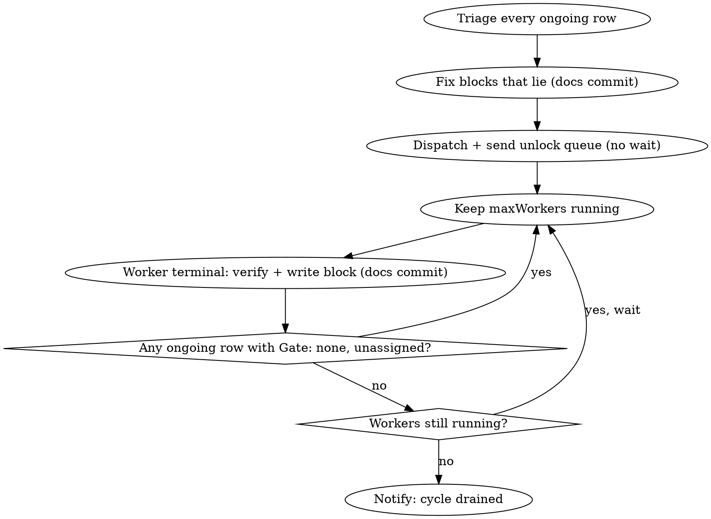

# Advance ongoing plans — drain the cycle

A cycle push is an `orchestrate` batch with a different **selection** and a different **finish line**. **REQUIRED SUB-SKILL:** run `orchestrate` for everything mechanical — naming, `batch.json`, dispatch, supervision, landing, the escalation contract, wind-down, and the repo facts it reads from `.agents/orchestrate.config.json` and `.agents/land.config.json`. This skill only replaces what `orchestrate` leaves open.

**The goal is a state of the map, not a set of PRs:** the cycle is drained when no plan under `docs/plans/ongoing/` (incl. `soak/` if the repo has one) reads `**Gate:** none` on `origin/<base>`. Every plan is then retired or waiting on something agents cannot do this cycle. No new metadata exists or is needed — the `Priority / Landed / Gate / Next` block from `managing-plans-lifecycle` and the generated map carry all of it.

**No `go`. The leader picks and dispatches on its own.** The user's only inbound traffic is the unlock queue (§3), `orchestrate`'s escalation contract, and the drained notice (§6). This overrides `orchestrate` Phase 1.4–1.5 for a cycle push: never end a message with "reply go", and never hold a dispatch waiting on an answer.

## Launch

The user starts the leader already named and accepting worker reports, so `orchestrate` Phase 0.1–0.2 need no manual step:

```bash
claude -n <project>-drain --settings '{"crossSessionInbound":"accept"}' "push the ongoing plans"
```

Started some other way? Ask once for `/rename <project>-drain` and the `/config` setting, but dispatch regardless — the `reports/*.log` channel carries the workers until the name is fixed.

## Pool

Only `ongoing/` and `ongoing/soak/`. Never `ready/` or `ideas/`, even when slots are free.

**Triage from the plan files, rank with the map.** The blocks on `origin/<base>` are the truth (`git fetch origin <base>`, then `git show origin/<base>:<plan>`); the committed map lags them until CI regenerates it after each push, and its *Actionable now* mixes in `ready/` rows. Use the map only for what it derives — `Advanced`, ⚠️, recheck dates — to break priority ties. Never commit a locally regenerated map.

## The loop



### 1. Triage every ongoing row — all sections, not just Actionable now

Put each ongoing/soak row in exactly one bucket:

| Bucket | Test | Action |
|---|---|---|
| **workable** | `Gate: none` and an agent can do `Next` from a worktree | pick |
| **fired** | the `release:`/`soak:`/`blocked:` trigger has already happened — the version is cut *and* live where the gate needs it, the soak date passed, the awaited deploy or PR exists, a `(recheck …)` date passed and the answer changed | set `Gate: none`, then re-bucket |
| **needs your go** | `Next` is anything the repo's `AGENTS.md` reserves for the user: a data write outside the autonomous env, a deploy or promotion to a release branch, a hard-stop merge, or a `decision:` | unlock queue; if the plan has a code half, pick it too |
| **human-only** | a phone, a store or cloud console UI, another repo, a person outside the session, a visual check on a real device | set `Gate: blocked:<the human step>` |
| **gated** | trigger genuinely in the future | leave |

Verify before bucketing (`orchestrate` Phase 1.2): a `Next` line is a claim, and ongoing plans drift — a step it names may already be merged. Check the trigger against reality (`gh`, `git log`, the deployed version, a read-only log query); never against the plan's prose. Verification-only work (confirm a log line, a dashboard row, then retire) is still a worker's, not the leader's.

### 2. Fix the blocks that lie, before anything else

Commit every correction found in triage as one docs commit to `<base>` (direct where the repo's `AGENTS.md` allows docs-only commits) — the whole block, not just `Gate`: a fired gate usually leaves `Next` stale, and a merged step leaves `Landed` behind. A row that reads `Gate: none` while no agent can move it makes the drained state unreachable; a fired gate left closed hides work.

- Waiting on another plan or an open PR → `blocked:<plan slug or PR #n>`.
- A vague soak ("days", "a while") → rewrite to a dated or observable trigger when the plan's own reasoning supports one; otherwise `decision:<the question>`.
- Anything you will want to look at again on a date → append ` (recheck YYYY-MM-DD)`.

Validate before committing — `node scripts/plans-map.js --validate; V=$?` — and read `$V` directly. A piped validate in a `validate && commit && push` chain once let an invalid `Gate` reach the base branch.

### 3. Dispatch, then send the unlock queue — never wait on it

**Pick by this order, with no confirmation:** plans freed (a plan whose work unblocks others first) > `Priority` > ⚠️ stale > smallest remaining work. One worker per plan, up to the config's **`maxWorkers`** at once. Queue the rest in `batch.json` and dispatch them as slots free.

Dispatch first, then send **one** message:

- **Dispatched / queued:** one line per worker — informational, not a question.
- **Unlocks:** every *needs your go* item, ranked by how many plans it unblocks, rendered as `orchestrate`'s decision block. Record each in `needsUser`. The user answers any subset, whenever; the leader runs each approved one itself, dry run first (`orchestrate` Phase 2), and messages the affected worker. An unanswered unlock blocks nothing but its own step.
- **Human-only list:** what only the user can do, one line each.

### 4. Worker finish line — add this block to `orchestrate`'s worker prompt

```
Your finish line is the PLAN, not a PR. Loop: do the plan's Next → PR → land
→ re-read the plan against origin/<base> → next step. Stop only when the plan
is fully done, or the next step needs something outside your reach (a release,
a soak, a non-dev write, a deploy, a human, a decision). Several PRs are
expected. Do NOT edit anything under docs/plans/ — the leader owns every plan
file. Your final report is exactly one of:
  RETIRE <plan path> — <evidence it is done, incl. production verification if it has a runtime surface>
  BLOCK <plan path>
    **Landed:** <none|dev|beta|prod|n/a>        (only if the repo tracks Landed)
    **Gate:** <release:x.y.z | soak:<trigger> | decision:<question> | blocked:<why>>
    **Next:** <one imperative line a cold worker can start>
    evidence: <PRs merged, what was verified>
```

### 5. On each terminal report

1. **Reject a report that cannot drain the cycle:** `Gate: none` with work left, a vague gate, or a `RETIRE` of runtime work with no production evidence ("merged is not verified"). Send it back.
2. Write the block — or retire the plan per `managing-plans-lifecycle` (`git rm`, extracting durable rationale to `docs/decisions/` only where the skill says so) — as a docs commit to `<base>`. Workers never touch plan files, so this never conflicts with their PRs.
3. Re-read the plans on `origin/<base>` and dispatch the next unassigned `Gate: none` ongoing row into the free slot. Re-triage only rows a landed PR could have changed.

### 6. Drained → notify once

When no plan file under `ongoing/` on `origin/<base>` reads `**Gate:** none` (read the files — the map regenerates later) and no worker in `batch.json` is non-terminal, send the user **one** message (and a `PushNotification`): "Everything for <current cycle from the map> that agents can advance is done", then the ongoing plans grouped by what they wait on — **you** (decisions/unlocks declined or pending), **a human step**, **release x.y.z**, **soak trigger** — plus what was retired this push. Then `orchestrate` Phase 4.

## Common mistakes

| Mistake | Instead |
|---|---|
| Treating "all workers terminal" as done | Done is the map state; refill slots until no `Gate: none` row remains |
| Rejecting a plan and leaving its `Gate: none` | Re-gate it (`blocked:<human step>`), or the cycle never drains |
| Skipping soak/blocked/release rows as "not pickable" | Check whether the trigger fired; many have |
| A worker stopping at a subset ("the 9 small files") with `Gate: none` left | The loop runs until the next step is out of reach |
| Filing data ops under "rejected" | They are unlocks — queue them ranked by plans freed |
| Ending the first message with "reply go" | Dispatch first; the message reports picks and asks only the unlocks |
| Bundling several plans into one worker to save slots | One plan per worker; slots refill as plans drain |
| Taking the batch `go` (or "I authorize everything") as covering each non-dev `--apply` | The permission classifier asks again per command, even under standing authorization (4 of 7 applies bounced in one push). Dry-run and back up first, then put the exact `--apply` commands to the user in one message |
| Trusting a plan's "backup and restore are ready" before a destructive run | Check the script writes one; dump every doc the dry run lists before `--apply` |
| Hand-merging a PR once "every non-reviewer check is green" | Confirm every lane the diff should trigger actually reported on the current head — a lane that never started is not green |
| Merging a green PR whose base moved underneath it | Diff the base's changes against the PR's files first; an intersection means rebase |
| Relaying a worker's diagnosis of a red lane or a queue | Check the jobs API yourself |
| Reading an exit code through a pipe in a `validate && commit && push` chain | Capture it (`cmd; V=$?`) |
